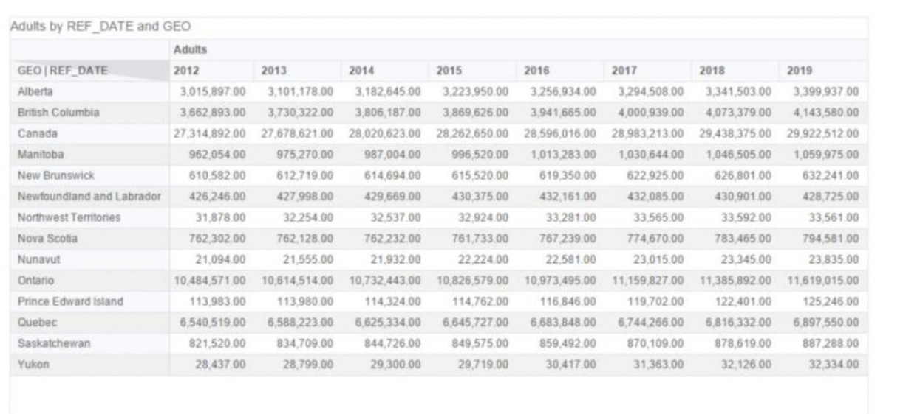

# SAP Lumira Discovery
SAP Lumira is used to analyze alcohol purchasing preference in Canada, and how does it differ by province over the last few years.

## About SAP Lumira Discovery

Personally, I have had an opportunity to work with an SAP gold partner company for 2 years as an associate consultant and majorly I helped Government of Saudi Arabia, Dubai, Fiji, and Qatar to build their Tax System. Overall, it was an exciting job and I have had the opportunity to use SAP Lumira as well during this experience, and honestly – I wasn’t a very big fan of it. SAP Lumira was launched in 2012 and it majorly uses SAP HANA as the data source. SAP Lumira is used for data analysis to create visualizations for stakeholders to take relevant decision to drive the business. I believe that SAP analytics cloud is far better even though it has limited capabilities as of now.

## Dataset and Research questions

SAP Lumira will be used to analyse the dataset which consist of the alcohol purchasing preferences in Canada. We will be studying 2 dataset that tells us about the provincial preference over the course of few years. The data majorly focuses on population and sales from Statistics Canada and are in CSV Format. The Research Questions are as follows:

1. What are the per Capita Sales of Canadian Products and Imported products in 2018 and how does it differ from 2008?
2. How do alcohol purchasing preferences vary in Canada over the last several years?
3. Number of adults who are legally allowed to purchase alcoholic beverages
4. How does alcohol preference differ between Nova Scotia and Canada over the last several years?
5. How do alcohol purchasing preferences vary in Nova Scotia, over the last several years?

## Applying the Analytical Tool and Results

Before diving into the research questions, we need to understand the dataset – this step was covered while doing LAB 2, and 5 important questions were taken into consideration for this study. 

##### Question 1: What are the per Capita Sales of Canadian Products and Imported products in 2018 and how does it differ from 2008?
The Imported beers are surprisingly preferred lesser than the Canadian Beer in 2008 and 2018 and the opposite trend is observed when taking wine into consideration. As this graph predicts the per capita sales, we can notice that the sales are more in 2008 than in 2018. Beer still remains the first choice for Canadians, and I believe is majorly governed by user preference. 

 
  

##### Question 2: How do alcohol purchasing preferences vary in Nova Scotia, over the last several years?
It is observed that the preference for beer has been downhill since 2009. That being said, Canadians prefer Canadian wine over Imported wine after 2016 and vice versa prior to that. 

 

##### Question 3: Number of adults who are legally allowed to purchase alcoholic beverages
The dimension was created in SAP Lumira and included all the people above the age of 19 years suggests that approximately 30 million people are adults in 2018 and total population is approximately 40 million.

 

##### Question 4: How do alcohol purchasing preferences vary in Canada, over the last several years?
A new file was created for this which has all the number of adults per province in all the years. This file was exported as a CSV file.

 

As observed in the above questions, Canadian beer is preferred more than imported beer whereas the opposite is observed in the case of wine. Beer preference has stagnated over the years whereas wine preference is increasing!

 

##### Question 5: How does alcohol preference differ between Nova Scotia and Canada over the last several years?
Canada: The Canadian beer has been losing its popularity in Canada and imported beer has been constant. Per capita sales of Canadian Beer are more than that of imported beer. 
Nova Scotia: The Canadian beer has been gaining popularity in Canada and imported beer is losing popularity. Beer is preferred by the people of Nova Scotia. 

 

## Analysis and Critique of the Tool

As a second-time user of SAP Lumira, this tool is easy to understand and use from importing the dataset to exporting the file containing all the data and its analysis. Even though, it was easy to use, I feel that many new technologies have come in the market with better interface. Even though it is a fairly new technology, and it has been created in 2012, but there have been many advancements in this domain which has brought many competitive tools that provide all the similar functionalities and more.

The strength of this tool is its ease-to-use and analyse the dataset via creating many visualizations of different kinds. Also, editing and transforming the data using this tool was very easy and can be learned by someone who doesn’t belong to a computer background.

The weakness of this tool is that it requires high RAM and creates an In-Memory Database when loading data that uses the PC’s RAM. Also, it is not MAC friendly. As a MAC user, I faced many difficulties in working with this tool and it was definitely not a fun task to struggle with a tool before even starting to learn about it.

## Conclusion:

Overall, Overall, SAP Lumira is a great tool to start working with the data in SAP and playing with the data to gain useful insights from it considering that it is being used on Windows. I still prefer SAP Analytics Cloud over SAP Lumira. As mentioned in the analysis above, many useful information was derived from the dataset used and it was easy to work with the complicated datasets. This tool made it easy to work with different datasets at the same time and it was good experience of learning about a new tool.
